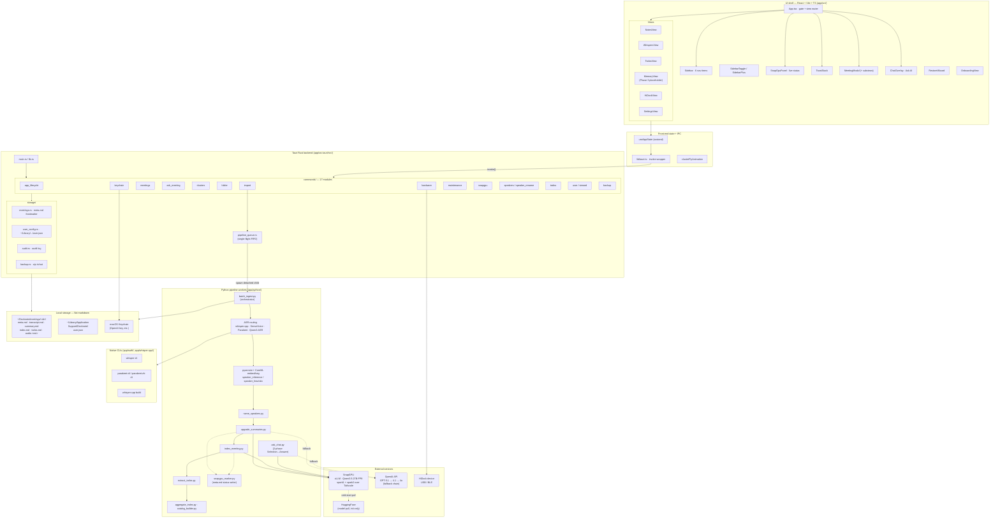
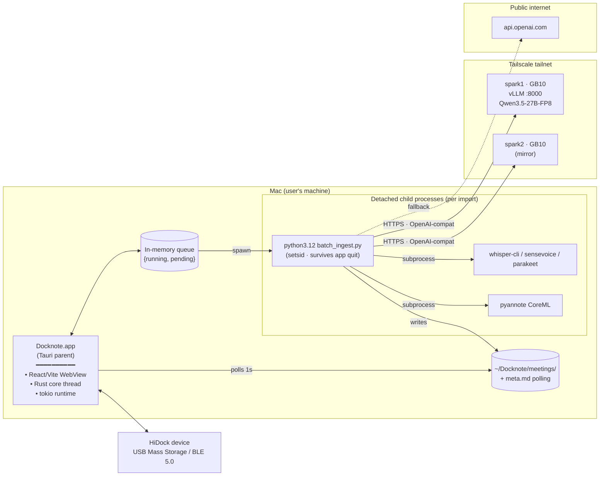
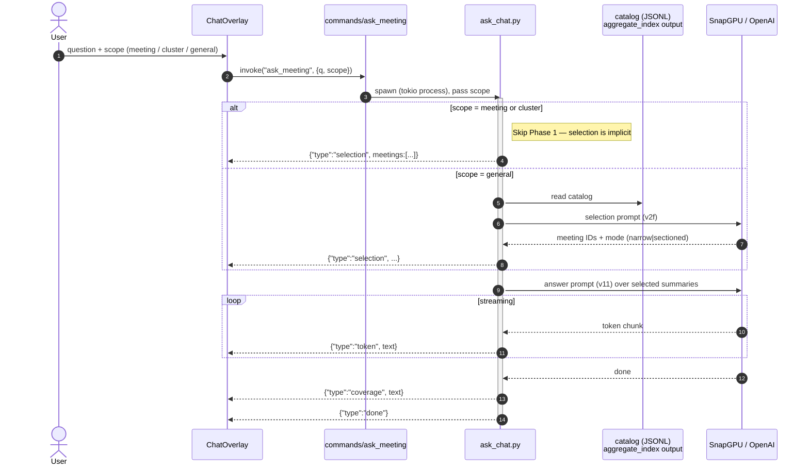
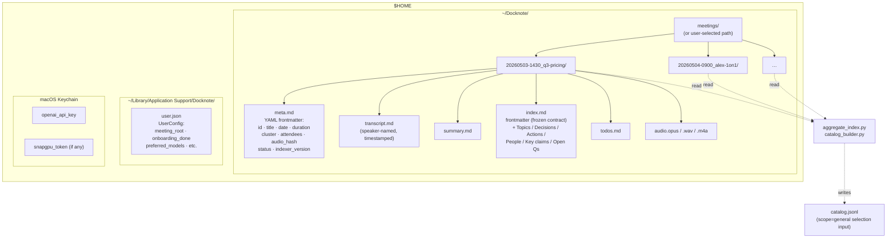
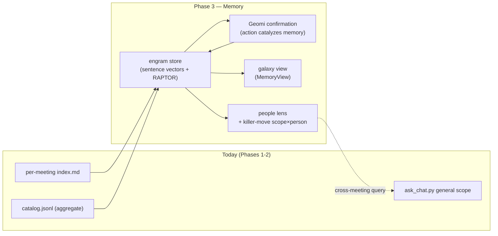

# Docknote — current architecture (as-built snapshot)

**Date:** 2026-05-05
**Author:** Claude (sr. full-stack pass)
**Source of truth:** `~/seanslab/Docknote/app/` source code at this date.
**Status:** Phases 1 & 2 shipped. Phase 3 (Memory) is in design — see `docknote-brainmemory-design.md`.

This is a fresh snapshot drawn from the live code, *not* from the older `docs/Docknote_Architecture_v3.md` (which is partially aspirational — HiDock-as-truth-source, hot/warm/cold tiers, encrypted-upload pipeline). Where the code and that doc disagree, this snapshot follows the code.

---

## 1. One-paragraph summary

Docknote is a **macOS Tauri app** (React + Vite + TS front-end; Rust backend; Python pipeline workers) that turns meeting audio into a flat, plain-text **`~/Docknote/meetings/<id>/`** corpus. Capture happens on a paired **HiDock** hardware device or via local file import; ASR + diarization run **locally** (Whisper.cpp / SenseVoice / Parakeet / Qwen3-ASR + pyannote-on-CoreML); summarisation, indexing, and Q&A run on **SnapGPU** (a private vLLM service on Sean's GB10 sparks reachable over Tailscale) with **OpenAI as cloud fallback**. Every meeting is its own folder of markdown files; there is no relational database for content. The React UI is six views (Notes / Whispers / Todos / Memory / HiDock / Settings) gated by a one-time onboarding wizard.

---

## 2. Layered component diagram



---

## 3. Runtime process topology

What's actually alive while the app runs.



**Key invariants encoded in code:**

- `pipeline_queue.rs` — **single-flight FIFO**. Concurrent imports do not spawn parallel pipelines; they queue. Drain task polls each running child's `meta.md` status until terminal, then pops.
- Children are detached with `setsid()` — if the user quits Docknote mid-pipeline, the child completes and the next launch sees the result.
- React polls `meta.md` at the same 1 s cadence the queue uses, so UI and queue see the same transition.
- The queue is **in-memory only**. Pending-but-not-yet-spawned imports are lost on app exit; the meeting dir + stub `meta.md` survive on disk so the user can re-import.

---

## 4. Import-and-process sequence

The load-bearing flow. Everything else (Notes view, Ask AI, Memory) reads what this writes.

```mermaid
sequenceDiagram
    autonumber
    actor User
    participant UI as React UI<br/>(NotesView)
    participant Rust as Tauri Rust<br/>(commands/import)
    participant Q as pipeline_queue
    participant Py as python batch_ingest
    participant ASR as ASR engine<br/>(whisper.cpp / SenseVoice / …)
    participant Pyan as pyannote + CoreML
    participant Snap as SnapGPU (vLLM)
    participant FS as ~/Docknote/meetings/&lt;id&gt;/

    User->>UI: pick audio file (or HiDock sync)
    UI->>Rust: invoke("import_audio", path)
    Rust->>Rust: hash audio (SHA-256, streaming)
    alt audio_hash already in some meta.md
        Rust-->>UI: existing meeting_id (no duplicate)
    else new meeting
        Rust->>FS: mkdir &lt;id&gt;/ + write stub meta.md
        Rust->>Q: enqueue(meeting_id)
        Q->>Py: spawn detached (setsid)
    end

    activate Py
    Py->>FS: meta.md status = "Transcribing"
    Py->>ASR: route by language / device
    ASR-->>Py: timestamped segments
    Py->>FS: write transcript.md
    Py->>FS: meta.md status = "Identifying speakers"
    Py->>Pyan: VAD + diarization + embeddings
    Pyan-->>Py: speaker turns + 256-d voiceprints
    Py->>Snap: speaker_naming prompt
    Snap-->>Py: human-readable speaker labels
    Py->>FS: rewrite transcript.md with names
    Py->>FS: meta.md status = "Summarizing"
    Py->>Snap: summary prompt (transcript)
    Snap-->>Py: summary.md content
    Py->>FS: write summary.md
    Py->>Snap: index_meeting prompt
    Snap-->>Py: structured index frontmatter + body
    Py->>FS: write index.md (idempotent: input_hash)
    Py->>Snap: extract_todos prompt
    Snap-->>Py: todo lines
    Py->>FS: append todos.md
    Py->>FS: meta.md status = "Complete"
    deactivate Py

    loop while Py running
        UI->>Rust: invoke("get_meeting_status")
        Rust->>FS: read meta.md frontmatter
        Rust-->>UI: status + stage chip
    end

    Q->>Q: pop next pending
```

**Idempotency:** `index_meeting.py` stores a SHA-256 of `transcript.md ‖ summary.md` in `index.md` frontmatter as `input_hash`. A re-run with unchanged inputs and matching `indexer_version` is a sub-50 ms no-op. Bumping `INDEXER_VERSION` forces a global re-index.

**Privacy boundary:** transcript + summary go up to the LLM (SnapGPU first, OpenAI fallback). Audio never leaves the device. Sensitive meetings stay on SnapGPU only — never routed to OpenAI.

---

## 5. Ask-AI sequence (Selection → Answer)

Two-phase RAG-without-vectors: a `selection` pass picks which meetings are relevant from a JSONL catalog, then an `answer` pass streams over the selected summaries.



**Stdout protocol** — one JSON object per line (UTF-8, `\n`). Event order is fixed: `selection → 0..N tokens → coverage → done`. On failure: `{"type":"error", ...}` and non-zero exit.

**Stub mode** — `DOCKNOTE_TEST_STUB=1` bypasses the LLM and emits canned events deterministically. Used by Rust integration tests and the eval harness.

---

## 6. Storage layout (the actual data model)



**No relational store for content.** SQLite makes no appearance for meeting data. The only state outside `~/Docknote/` is `user.json` (preferences) and the Keychain (secrets). Everything else is markdown.

**The `DOCKNOTE_MEETING_ROOT` env var** overrides `meeting_root()` and is used by tests and by the bundled sample-meeting onboarding demo (REQ-058). Production never sets it.

---

## 7. Tauri command surface (the IPC contract)

| Module | Representative commands | Purpose |
|---|---|---|
| `app_lifecycle` | startup hooks, shutdown | one-shot init, prefetch keychain, kick GrowthBook |
| `import` | `import_audio`, internal `spawn_pipeline` | hash → dedupe → enqueue → detached spawn |
| `meetings` | `list_meetings`, `get_meeting_status`, `get_meeting`, `delete_meeting` | read-side over `~/Docknote/meetings/` |
| `ask_meeting` | streaming Q&A | spawn `ask_chat.py`, pipe JSON-lines back to UI |
| `clusters` | list / set / rename | cluster colour + assignment per meeting |
| `folder` | choose meeting root, validate | wave-10 user-selectable corpus path |
| `hardware` | enumerate / connect / sync | HiDock USB + BLE |
| `keychain` | store / read / delete secret | wrapper over macOS Keychain |
| `maintenance` | rebuild index, vacuum tmp | manual admin actions |
| `snapgpu` | health, panel state | live status of vLLM endpoints |
| `speakers / speaker_rename` | rename across one meeting (Unicode-aware) | regex with `\p{L}\p{N}` boundaries |
| `todos` | list / toggle / extract | UI for `todos.md` rollup |
| `user / viewed` | preferences, "seen" flags | `user.json` writes |
| `backup` | zip out / zip in (RestoreWizard) | full corpus snapshot |

---

## 8. Python pipeline surface (the worker scripts)

| Stage | Script | LLM? | Notes |
|---|---|---|---|
| Orchestrator | `batch_ingest.py` | — | called per detached spawn; sequences the rest |
| ASR (English fast) | `whisper.cpp` via Swift CLI | local | default English path |
| ASR (CJK) | `sensevoice_cli.py` | local | wave-18 CJK routing |
| ASR (Parakeet) | `parakeet-cli` / `parakeet-zh-cli` | local | alternative engine |
| ASR (Qwen3) | `qwen3_asr_cli.py` | local | newest, optional |
| VAD / diarization | `coreml_embedding.py`, `export_segmentation_coreml.py`, `run_pyannote_smoke*.py` | local | pyannote-segmentation-3.0 + ECAPA-TDNN, both as CoreML packages |
| Speaker fusion | `speaker_inference.py`, `speaker_heuristic.py` | local | turn alignment + clustering |
| Speaker naming | `name_speakers.py` | LLM | first cloud step; sensitivity routes to SnapGPU only |
| Summary | `upgrade_summaries.py` | LLM | preferred chain GPT-5.1 → 4.1 → 4o or SnapGPU |
| Index | `index_meeting.py` | LLM | wraps in `snapgpu_marker.mark_active(_, "Summarizing")` so UI shows the same chip |
| Todos | `extract_todos.py` | LLM | best-effort, non-blocking on failure |
| Aggregate | `aggregate_index.py`, `catalog_builder.py` | — | rebuilds the catalog used by general-scope Ask |
| Ask | `ask_chat.py` | LLM | not in import path; spawned per Ask-AI invocation |
| Status helper | `snapgpu_marker.py` | — | atomic meta.md status writer |
| Quality | `coverage_note.py`, `quality_export.py` | — | dev/eval only |

---

## 9. External integrations

**SnapGPU (primary LLM).** vLLM 0.7+ serving `Qwen/Qwen3.5-27B-FP8` on Sean's GB10 spark1 (spark2 mirror) over Tailscale, port 8000, OpenAI-compatible Chat Completions API. The macOS client treats it as a URL flip from `api.openai.com`. Cold start ≈ minutes; steady-state latency competitive with cloud GPT-4o. Spec: `~/seanslab/Docknote/docs/sdd-snapgpu-v2.md` + `~/seanslab/Docknote/app/snapgpu/README.md`.

**OpenAI fallback.** `upgrade_summaries.PREFERRED_MODELS` chain: GPT-5.1 → 4.1 → 4o. Triggered when SnapGPU unhealthy or explicitly disabled per-meeting (settings). Sensitive meetings never fall back to OpenAI.

**HiDock device.** Hardware capture target. USB Mass Storage on desktop; BLE 5.0 GATT on (future) mobile. App auto-discovers `meetings/` subtree, copies new audio into `~/Docknote/meetings/<id>/`, then enqueues import. Code: `commands/hardware.rs`.

**HuggingFace.** Init-only — `huggingface-cli download` to populate the spark with model weights. No runtime traffic from the client.

---

## 10. What the v3 architecture doc claims vs. what the code does

Recording these intentionally so future readers don't follow a stale spec.

| v3 doc claims | Code reality (2026-05-05) |
|---|---|
| HiDock is the truth source; client is cache only | `~/Docknote/meetings/` on the user's Mac is the truth; HiDock is one ingest path among many (file import is equally first-class) |
| SQLCipher encrypted local cache | No SQLCipher anywhere; flat markdown only |
| Hot / warm / cold tiers, ZIP archive for cold | Flat directory; backup is a separate zip-in/zip-out feature, not a tiering scheme |
| Cloud "tmpfs · burn-after-read" with E2EE envelope | SnapGPU is plain HTTPS over Tailscale to a private vLLM; the privacy story is "private network + no server-side persistence", not memset+envelope |
| Modal / RunPod serverless | Self-hosted spark1+spark2 GB10s; Modal/RunPod were earlier candidates, deferred to Phase 3 per REQ-078 |
| LLM-driven structured global indices (`timeline.md`, `topics.md`, `decisions.md`) maintained by cloud | Per-meeting `index.md` only; an `aggregate_index.py` rolls up locally into `catalog.jsonl` for Ask-scope=general. No global `timeline.md`. |

The Phase-3 Memory work (`docknote-brainmemory-design.md`) is where the cross-meeting recall layer actually lands — engrams + galaxy + Geomi confirmation flow — and it deliberately does *not* re-introduce the `facts` table the v3 doc implied (principle 1: less structure, more intelligence).

---

## 11. Where Memory (Phase 3) plugs in

Locked landing surface: `rachel-redesign/v4.3-memory-galaxy-floating-ask.html`. Spec: `docknote-brainmemory-design.md` §9.1.



**Integration constraints (from the two locked principles):**
1. The engram store is an **index, not a facts table**. The markdown corpus stays the only truth. (principle 1)
2. Every consequential write to user-visible memory routes through Geomi confirmation. Direct file edit remains a power-user escape hatch. (principle 2)

What's still unresolved (per the conversation that triggered this diagram): consolidation pass triggers, Karpathy `cortex/` read-write contract, entity resolution for the people lens, retrieval shape for the four people-lens queries, and the `note ↔ engram` cardinality (does one long meeting yield one engram or many?).

---

**Companion file:** `docknote-architecture.html` — same content with mermaid rendered in-browser. Open in any browser; no server.
